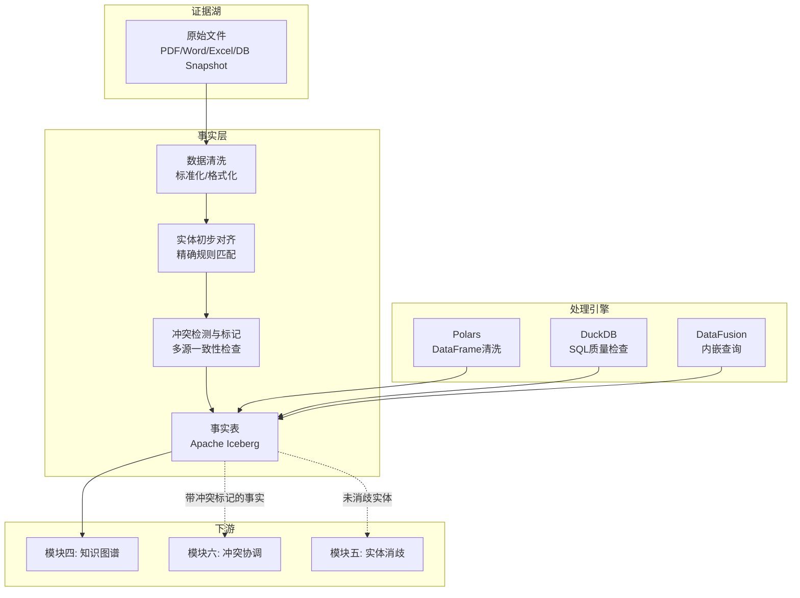

好的，基于我们刚明确的**职责分离原则**，以下是重新编写的模块三方案。

---

## 模块三：事实层设计说明书 v2.0

### 1. 功能定位

事实层是 Causis 从“原始证据”到“可推理知识”的关键转化层。它的核心使命是：

- **忠实地将多源数据转化为标准化事实**：对证据湖中的原始数据进行清洗、对齐和结构化。
- **发现并标记事实冲突，但不裁决**：当多源数据对同一事实给出不同版本时，事实层负责发现这些不一致并显式标记，但**不做最终裁决**——裁决权属于模块六（冲突协调引擎）。
- **为知识图谱提供高质量、可溯源的输入**：每一条事实都附带完整的溯源链和质量评分，供下游推理使用。

### 2. 核心职责边界

```
┌─────────────────────────────────────────────────────────────┐
│  模块三：事实层                                               │
│                                                             │
│  做这些：                                                    │
│  ✅ 数据清洗与标准化                                          │
│  ✅ 实体初步对齐（规则驱动）                                   │
│  ✅ 事实冲突检测与标记                                        │
│  ✅ 质量评分与溯源记录                                        │
│  ✅ 输出标准化事实表（含冲突标记）                               │
│                                                             │
│  不做这些：                                                  │
│  ❌ 冲突的消解与仲裁（→ 模块六）                               │
│  ❌ 复杂模糊实体消歧（→ 模块五）                               │
│  ❌ 缺失关系/属性补全（→ 模块五）                              │
│  ❌ 因果推理（→ 模块七）                                      │
└─────────────────────────────────────────────────────────────┘
```

### 3. 轻量级架构设计



### 4. 详细功能设计

#### 4.1 数据清洗与标准化

**目标**：将多源异构数据转化为统一、清洁的结构化形式，保留原始值，新增标准化值。

**核心能力**：

| 处理类型       | 示例                                      | 实现方式               |
| :------------- | :---------------------------------------- | :--------------------- |
| **类型标准化** | 日期：`"2024年1月15日"` → `2024-01-15`    | Polars UDF             |
| **格式规范化** | 电话：`139-1234-5678` → `+86 13912345678` | 正则规则链             |
| **空值处理**   | `"N/A"`, `"-"`, `""` → `NULL`             | 配置驱动的映射表       |
| **编码统一**   | GBK → UTF-8                               | Polars 自动检测 + 转换 |
| **结构化提取** | 复杂嵌套JSON → 平铺列                     | `jmespath` 表达式      |

**关键设计**：
- **不覆盖原则**：所有标准化结果写入新列（如 `value_standardized`），原始值保留在 `value_raw` 列中。
- **清洗规则可配置**：清洗规则以 YAML/JSON 配置文件形式管理，支持按数据源定制，无需修改代码。

#### 4.2 实体初步对齐

**目标**：在事实写入 Iceberg 表之前，识别来自不同源但指向同一真实世界实体的记录，赋予统一的 `entity_id`。

**对齐策略（三级递进）**：

| 级别                 | 方法                                               | 置信度        | 处理方式                                               |
| :------------------- | :------------------------------------------------- | :------------ | :----------------------------------------------------- |
| **L1: 精确匹配**     | 身份证号、工号、统一社会信用代码等强ID字段完全一致 | 高 (>0.95)    | **自动合并**，赋予相同 `entity_id`                     |
| **L2: 高置信度规则** | 姓名+生日+部门 三者同时匹配                        | 中 (0.7-0.95) | **自动合并**，但记录匹配置信度分数                     |
| **L3: 模糊匹配**     | 仅姓名相似（编辑距离 < 阈值）、或仅部门相同        | 低 (<0.7)     | **标记为待消歧**，创建临时 `entity_id`，交由模块五处理 |

**关键技术实现**：
- **L1/L2**：使用 Polars 的 `join` 和窗口函数，在数据处理管道中直接完成。
- **L3**：不在此模块处理。数据写入事实表时，其 `entity_id` 设为 `NULL` 或临时ID（如 `cluster_xxx`），并在 `entity_status` 列标记 `ambiguous`，交由模块五通过向量相似度、图神经网络等方法进行复杂消歧。
- **对齐审计**：每次对齐决策都记录在 `alignment_log` 元数据表中，包含匹配字段、分数、时间戳。

#### 4.3 冲突检测与标记

**目标**：当多个数据源对同一实体的同一属性给出不同值时，自动发现并显式标记，但不做任何裁决。

**冲突检测机制**：

| 冲突类型     | 检测逻辑                                                     | 示例                                                         |
| :----------- | :----------------------------------------------------------- | :----------------------------------------------------------- |
| **精确冲突** | 同一 `entity_id` + 同一 `attribute`，但 `value_standardized` 不同 | HR系统：张三.部门 = "研发部"; 门禁系统：张三.部门 = "产品部" |
| **语义冲突** | 经文本相似度计算，含义存在矛盾                               | 合同：年假5天; 员工手册：年假10天                            |
| **结构冲突** | 违反已知的业务规则或Schema约束                               | 员工状态="离职"，但仍有下周期考勤记录                        |
| **时效冲突** | 同一属性给出了不同时间区间内的不同值（非错误，是版本差异）   | F-2.3中的“时间旅行”机制区分                                  |

**冲突标记 Schema**：

冲突不创建新表，直接在事实表中通过以下字段标记：

| 字段                  | 类型          | 说明                               |
| :-------------------- | :------------ | :--------------------------------- |
| `conflict_status`     | Enum          | `none` / `detected` / `resolved`   |
| `conflict_type`       | Array[String] | `["exact", "semantic"]` 等         |
| `conflict_group_id`   | UUID          | 同一冲突组的唯一标识，方便分组查看 |
| `conflicting_sources` | Array[String] | 列出所有给出不同值的源文件路径     |
| `alternative_values`  | JSON          | 所有冲突版本的键值对列表           |

**MVP 实现方式**：
- 使用 **DuckDB** 或 **DataFusion** 执行 SQL 检查：
  ```sql
  -- 精确冲突检测
  SELECT entity_id, attribute, 
         LIST(DISTINCT value_standardized) AS vals,
         COUNT(DISTINCT value_standardized) AS version_count
  FROM fact_table
  GROUP BY entity_id, attribute
  HAVING version_count > 1;
  ```
- 检测结果自动更新 `conflict_status` 为 `detected`，并生成 `conflict_group_id`。

#### 4.4 质量评分

**目标**：为每条事实计算可信度评分，供下游推理引擎和冲突协调模块参考权重。

**评分维度（ISO 8000/25012 对齐）**：

| 维度           | 计算方式                         | 权重 |
| :------------- | :------------------------------- | :--- |
| **完整性**     | 非空字段数 / 总字段数            | 25%  |
| **一致性**     | 是否符合定义的格式/Schema规则    | 25%  |
| **时效性**     | 数据最近更新时间距今的天数       | 20%  |
| **来源权威性** | 数据源的可信度预设分值（可配置） | 30%  |

**技术实现**：
- 使用 **DataProf** (Rust) 自动计算完整性、唯一性等基础指标。
- 来源权威性分数从配置文件中的 `source_authority_score` 读取。
- 最终 `quality_score` 写入事实表，类型为 `Float`（0-1.0）。

#### 4.5 溯源字段设计

每条事实必须携带完整的溯源信息，以确保“任何一条结论都能追溯到原始文件的具体段落”：

| 溯源字段            | 类型      | 说明                                           |
| :------------------ | :-------- | :--------------------------------------------- |
| `_source_file`      | String    | 原始文件路径，如 `s3://raw/hr/roster_2024.pdf` |
| `_source_location`  | String    | 在文件中的位置，如 `第3页, 第2段, 表格第5行`   |
| `_ingestion_time`   | Timestamp | 数据进入证据湖的时间                           |
| `_processing_time`  | Timestamp | 事实层处理时间                                 |
| `_commit_id`        | String    | 对应上游 lakeFS/Iceberg 的版本commit ID        |
| `_provenance_chain` | JSON      | 完整处理链路记录                               |

### 5. 核心技术选型

| 组件         | 选型                | 语言           | 核心优势                             | 在模块三中的角色                |
| :----------- | :------------------ | :------------- | :----------------------------------- | :------------------------------ |
| **表格式**   | Apache Iceberg      | (iceberg-rust) | ACID事务、时间旅行、开放标准         | 事实表存储格式                  |
| **数据处理** | Polars              | Rust           | 单机高性能DataFrame，比pandas快~45倍 | 数据清洗、标准化、L1/L2实体对齐 |
| **质量检查** | DataProf            | Rust           | 自动数据画像、完整性/唯一性检查      | 质量评分自动化                  |
| **SQL查询**  | DuckDB / DataFusion | C++ / Rust     | 嵌入式OLAP，直接查询Iceberg          | 冲突检测SQL、即席分析           |
| **对象存储** | RustFS              | Rust           | S3兼容、Apache 2.0、轻量             | 存储Iceberg数据文件             |

### 6. 事实表 Schema 设计

**核心事实表 `fact.live`：**

| 列名                  | 类型          | 必须 | 描述                                   |
| :-------------------- | :------------ | :--- | :------------------------------------- |
| `fact_id`             | UUID          | ✅    | 唯一标识                               |
| `entity_id`           | String        | ✅    | L1/L2对齐后的统一实体ID                |
| `entity_status`       | Enum          | ✅    | `resolved` / `ambiguous` / `unmatched` |
| `attribute`           | String        | ✅    | 属性名                                 |
| `value_raw`           | String        |      | 原始值                                 |
| `value_standardized`  | Variant       |      | 标准化后的值                           |
| `data_type`           | String        |      | string / int / date / boolean          |
| `source_id`           | String        | ✅    | 数据源标识                             |
| `_source_file`        | String        | ✅    | 原始文件路径                           |
| `_source_location`    | String        |      | 文件内的具体位置                       |
| `_commit_id`          | String        | ✅    | 版本追溯ID                             |
| `_provenance_chain`   | JSON          |      | 完整处理链路                           |
| `conflict_status`     | Enum          | ✅    | `none` / `detected` / `resolved`       |
| `conflict_group_id`   | UUID          |      | 冲突分组ID                             |
| `conflicting_sources` | Array[String] |      | 冲突源列表                             |
| `alternative_values`  | JSON          |      | 所有冲突版本的值                       |
| `quality_score`       | Float         | ✅    | 综合质量评分 (0-1)                     |
| `valid_from`          | Timestamp     | ✅    | 事实生效时间                           |
| `processed_at`        | Timestamp     | ✅    | 处理时间戳                             |

### 7. 冲突检测 SQL 示例

以下是 MVP 阶段可直接使用的冲突检测查询（在 DuckDB/DataFusion 上执行）：

```sql
-- 1. 精确冲突检测
-- 找到同一实体同一属性有多个不同标准化值的记录
SELECT 
    entity_id, 
    attribute, 
    COUNT(DISTINCT value_standardized) as version_count,
    LIST(DISTINCT value_standardized) as conflicting_versions,
    LIST(DISTINCT _source_file) as sources
FROM fact.live
WHERE entity_status = 'resolved'
GROUP BY entity_id, attribute
HAVING version_count > 1;

-- 2. 结构冲突检测
-- 检测违反业务规则的情况：离职员工仍有活跃记录
SELECT 
    f1.entity_id,
    f1.value_standardized as status,
    f2.attribute as active_record_type,
    f2.value_standardized as active_record_detail
FROM fact.live f1
JOIN fact.live f2 ON f1.entity_id = f2.entity_id
WHERE f1.attribute = 'employee_status' 
  AND f1.value_standardized = '离职'
  AND f2.attribute = 'last_checkin_date'
  AND f2.value_standardized > f1.valid_from;

-- 3. 时效冲突检测
-- 找到同一事实在时间上有重叠的两个版本
SELECT 
    a.fact_id as fact_a,
    b.fact_id as fact_b,
    a.entity_id,
    a.attribute,
    a.value_standardized as val_a,
    b.value_standardized as val_b,
    a.valid_from as a_from,
    b.valid_from as b_from
FROM fact.live a
JOIN fact.live b 
    ON a.entity_id = b.entity_id 
    AND a.attribute = b.attribute
    AND a.fact_id < b.fact_id
    AND a.valid_from < b.valid_from
WHERE a.value_standardized <> b.value_standardized;
```

### 8. 与上下游模块的接口契约

| 接口                     | 方向 | 内容                                         | 格式                                 |
| :----------------------- | :--- | :------------------------------------------- | :----------------------------------- |
| **← 证据湖（模块二）**   | 输入 | 清洗前的原始数据流                           | Arrow RecordBatch                    |
| **→ 知识图谱（模块四）** | 输出 | 标准化事实（`conflict_status = none`）       | Iceberg 上的事实表视图               |
| **→ 实体消歧（模块五）** | 输出 | `entity_status = ambiguous` 的记录           | Iceberg 子集查询                     |
| **→ 冲突协调（模块六）** | 输出 | `conflict_status = detected` 的记录          | Iceberg 子集查询                     |
| **← 冲突协调（模块六）** | 反馈 | 已仲裁的事实（`conflict_status = resolved`） | 回写到事实表，`conflict_status` 更新 |

### 9. 实施路径（MVP 阶段）

| 步骤             | 任务                                                 | 核心产出                                  | 关键组件                |
| :--------------- | :--------------------------------------------------- | :---------------------------------------- | :---------------------- |
| **S1: 核心管道** | 搭建 Polars 数据清洗管道，支持类型标准化和格式规范化 | 能从 Iceberg 读取原始数据并输出标准化结果 | Polars, iceberg-rust    |
| **S2: 初步对齐** | 实现 L1（精确ID匹配）和 L2（高置信度规则）实体对齐   | 同一员工的不同记录被赋予相同 `entity_id`  | Polars JOIN + 规则引擎  |
| **S3: 冲突标记** | 实现精确冲突检测 SQL 并自动标记                      | 冲突记录 `conflict_status = detected`     | DuckDB                  |
| **S4: 溯源记录** | 为每条事实自动填充溯源字段                           | 全链路溯源可查询                          | 自研 Provenance Tracker |
| **S5: 质量评分** | 集成 DataProf，计算并写入质量分数                    | 每条事实有 `quality_score`                | DataProf (Rust)         |

### 10. 总结

重写后的模块三聚焦于“忠实地呈现事实原貌并发现矛盾”，核心差异化体现在：

- **不裁决原则**：发现冲突但不下结论，保持中立，裁决权归于模块六。
- **三级实体对齐**：L1/L2 在模块三内完成，L3 交由专门的消歧模块（模块五）。
- **冲突显式标记**：在事实表中直接标记冲突状态和冲突组，供下游高效消费。
- **全链路溯源**：每条事实可追溯到原始文件段落，为因果推理提供完整证据链。
- **纯 Rust 轻量栈**：Polars + DataFusion + DataProf，单二进制部署，零运维依赖。

---

模块三已重写完毕，职责清晰，边界明确。接下来我们可以继续深入**模块四：知识图谱（推理层）**，讨论轻量级图数据库选型（KuzuDB、CozoDB 等），以及如何将事实层的数据构建为可推理的因果知识图谱。