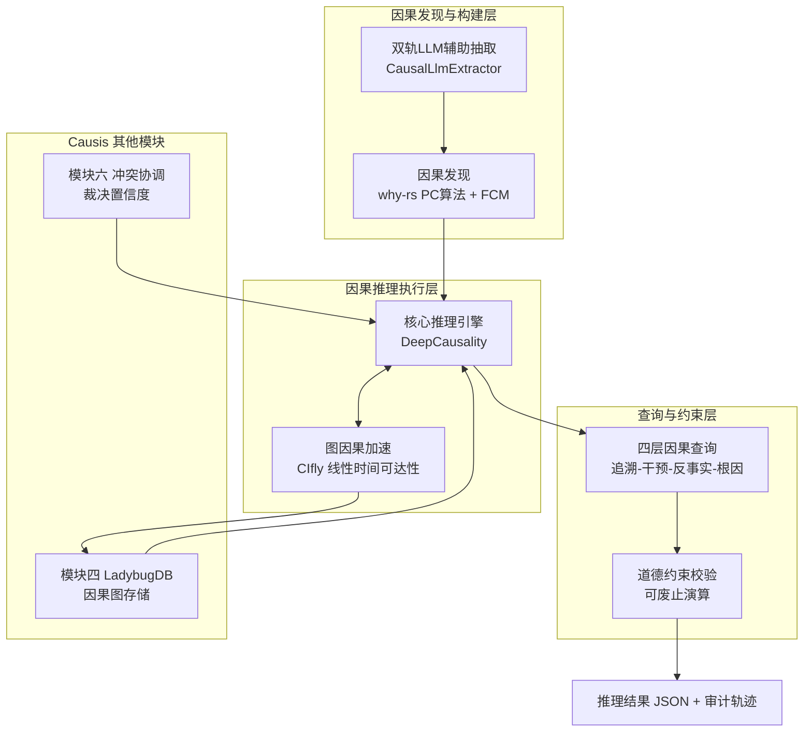

## 模块七：因果推理与查询引擎 详细设计方案（整合版）

### 1. 模块定位与核心职责

模块七是 Causis “因果即服务”架构的最终推理与查询层。经过前六个模块的接入、清洗、存储、消歧与冲突协调，企业多源数据已转化为一张高质量、可溯源的因果知识图谱。模块七的使命是让这张因果图真正可计算、可查询、可解释，对外提供四个层级的因果查询能力：因果链追溯、干预效应估计、反事实推演、根因定位。

本模块的因果推理完全基于形式化模型，大模型仅作为因果图构建阶段的辅助工具，不参与运行时推理计算。所有推理结果均附带完整溯源链和道德约束校验，实现“可认证的因果推理”。

### 2. 核心设计理念

- **因果图是活体**：推理引擎始终基于最新的因果边和冲突裁决结果，因果边强度随新观测动态演化。
- **计算与存储分离**：推理核心是纯函数式计算层，因果数据通过统一图抽象接口注入，实际持久化由模块四 LadybugDB 负责。
- **推理彻底透明**：每条因果声明均附带可追溯的证据链——从因果路径节点到冲突裁决再到文件锚点。
- **神经-符号协同**：大模型辅助因果陈述抽取（构建层），形式化因果引擎负责推理计算（执行层），可废止演算约束保障安全合规（约束层）。
- **纯 Rust 零外部依赖**：所有推理计算均在进程内完成，不需外部推理服务或 GPU。

### 3. 整体架构

模块七由三大子系统构成：**因果发现与构建层**、**因果推理执行层**、**查询与约束层**。

**数据流**：因果图从 LadybugDB 导出 → 注入 DeepCausality 构建推理有向无环图 → CIfly 加速 d-分离与可达性 → 因果单子执行效应传播/干预/反事实 → 约束校验 → 输出标准化结果，同时持久化推理审计表回 LadybugDB。

### 4. 详细功能设计

#### 4.1 因果发现与构建

**离线因果发现（why-rs）**
- **PC 算法**：从观测数据（模块三事实表）自动学习因果骨架，无需先验知识，输出无向因果边候选集。
- **功能因果模型（FCM）**：将学习到的因果结构转换为可干预的结构方程模型，持久化至 LadybugDB 因果边属性表，供后续干预分析直接调用。
- **干预原生支持**：通过 `intervene!` 宏直接施加 do-operator 语义，与 DeepCausality 的干预分析层无缝对接。

**LLM 辅助因果抽取（双轨制）**
- **本地推理轨**：通过 `Candle` 加载 ONNX 因果抽取模型，进程内推理，零外部依赖，适用于低延迟同步抽取场景。
- **API 调用轨**：通过 `reqwest` + `tokio` 调用兼容 OpenAI 接口的 LLM API（DeepSeek/SiliconFlow 等），适用于高复杂度文本批量抽取。
- **自动降级与升级**：API 不可用时自动降级至本地模型；本地模型置信度不足时（可选）升级至 API。保证构建管道持续可用。
- **统一输出 Schema**：本地模型与 API 共享同一套 CausalExtractionPrompt 模板，输出标准三元组（原因、结果、置信度、类型、来源锚点）。

#### 4.2 因果推理执行

**核心推理引擎（DeepCausality）**
- **因果单子式计算**：采用因果单子模式实现效应传播、干预注入和反事实分支。每次 bind 调用自动记录审计日志，支持错误短路。
- **效应传播**：沿因果路径拓扑排序节点逐层计算，自动管理上下文状态。
- **干预分析**：`intervene` 方法在指定节点强制注入干预值，后续节点重新计算，精确输出干预效应。
- **反事实推演**：基于结构因果模型重新计算假设世界状态，输出反事实效应、与观测效应的差异及完整推理叙事链。

**图因果加速（CIfly）**
- 将 d-分离测试、工具变量搜索等因果图操作归约为线性时间可达性查询，在 13 变量图上比传统方法快约 90 倍，内存占用降低约 3.6 倍。
- 通过因果规则表文件动态加载图结构，支持推理过程中的实时可达性判定。

#### 4.3 四层因果查询引擎

| 层级   | 查询类型   | 输入                      | 输出                                     |
| :----- | :--------- | :------------------------ | :--------------------------------------- |
| **L1** | 因果链追溯 | 观察到的因果陈述“A→B→C→D” | 完整传递路径 + 各步置信度 + 证据锚点     |
| **L2** | 干预效应   | `do(X=3)` 干预指令        | 干预后效应分布 + 干预有效性统计检验      |
| **L3** | 反事实推演 | “如果当时X没发生会怎样？” | 反事实效应 + 与观察差异 + 推理叙事链     |
| **L4** | 根因定位   | 多变量异常信号            | 各潜在原因 Shapley 贡献度排序 + 证据支持 |

#### 4.4 道德约束与安全

- **可废止演算约束层**：所有因果输出在返回前必须通过约束规则校验（如“不得输出基于受保护特征的归因结论”）。
- **审计完整性**：推理路径、输入版本、干预节点、反事实参数、约束校验结果全部持久化至 LadybugDB 推理审计表。
- **经验基准**：引入可废止演算层后，AI 正确因果归因准确率从 52% 提升至 83%（已有学术基准）。

### 5. 技术选型总览

| 组件             | 选型                           | 语言      | 核心作用                               | 许可           | 项目活跃度                      |
| :--------------- | :----------------------------- | :-------- | :------------------------------------- | :------------- | :------------------------------ |
| **核心推理引擎** | **DeepCausality**              | Rust      | 因果单子效应传播、干预分析、反事实计算 | Apache 2.0     | Linux Foundation 托管，持续更新 |
| **因果发现**     | **why-rs**                     | Rust      | PC 算法因果骨架学习 + FCM 干预建模     | MIT/Apache 2.0 | 2025.12 持续发布新版本          |
| **图因果加速**   | **CIfly**                      | Rust      | 线性时间 d-分离、可达性、工具变量      | MIT            | 活跃                            |
| **LLM 辅助抽取** | **双轨抽象**                   | Rust      | 本地 ONNX 推理 + 兼容 API 调用         | —              | 模块五 ONNX 运行时复用          |
| **约束校验**     | **DeepCausality Effect Ethos** | Rust      | 可废止演算道德约束                     | Apache 2.0     | 内建于 DeepCausality            |
| **因果图存储**   | **LadybugDB**                  | C++ (FFI) | 因果边持久化与推理审计表               | MIT            | Kuzu 团队维护                   |

### 6. 神经-符号协同工作流

1. **构建层（神经）**：双轨 LLM 从非结构化文本中抽取因果陈述三元组，经模块六冲突裁决后写入 LadybugDB 因果边表。
2. **发现层（符号+统计）**：why-rs 从模块三结构化事实表中读取观测样本，运行 PC 算法恢复无向因果骨架，FCM 对骨架进行干预建模并写入因果边表。
3. **执行层（符号）**：推理请求到达时，DeepCausality 从 LadybugDB 加载对应因果子图，构建有向无环图，CIfly 完成可达性加速；因果单子执行效应传播/干预/反事实运算。
4. **校验层（符号逻辑）**：可废止演算对推理输出逐条校验，拒绝违反预设约束的结论，放行的结论附带审计轨迹返回。

### 7. 推理审计表设计（LadybugDB）

| 字段                   | 类型        | 说明                                                       |
| :--------------------- | :---------- | :--------------------------------------------------------- |
| `trace_id`             | UUID        | 推理请求唯一标识                                           |
| `query_type`           | Enum        | `trace` / `intervention` / `counterfactual` / `root_cause` |
| `causal_graph_version` | String      | LadybugDB 中因果边的版本快照 ID                            |
| `input_params`         | JSON        | 干预变量、反事实假设等参数                                 |
| `inference_path`       | JSON        | 节点序列 + 每条边的置信度 + 传播效应值                     |
| `evidence_chain`       | Array[UUID] | 指向模块三事实表溯源标识的数组                             |
| `result`               | Variant     | 推理结论                                                   |
| `constraint_check`     | Boolean     | 是否通过道德约束校验                                       |
| `timestamp`            | Timestamp   | 推理时间戳                                                 |
| `llm_used`             | Boolean     | 构建阶段是否使用 LLM API（用于审计与成本归因）             |

### 8. 轻量性与可移植性保证

- 所有推理组件均为 Rust 原生库或通过 FFI 绑定的 C++ 库（LadybugDB），零 Python/Java 运行时依赖。
- DeepCausality、why-rs、CIfly 均以纯 Rust 发布，支持 `cargo build --release` 单二进制编译。
- 本地 ONNX 模型推理基于 `Candle`，无需额外推理框架安装。
- 无 GPU 强制要求，在笔记本 CPU 上完成因果推理任务。

### 9. 与 Causis 其他模块的协作接口

| 接口         | 源模块           | 目标模块 | 数据内容                     | 协议/格式            |
| :----------- | :--------------- | :------- | :--------------------------- | :------------------- |
| 因果边持久化 | 模块四 LadybugDB | 模块七   | 因果边（方向、置信度、溯源） | LadybugDB Cypher     |
| 裁决置信度   | 模块六 冲突协调  | 模块七   | 每条事实的质量/裁决置信度    | Iceberg表字段        |
| 事实观测数据 | 模块三 事实层    | 模块七   | why-rs 因果发现输入样本      | Arrow RecordBatch    |
| 非结构化文本 | 模块一/模块二    | 模块七   | LLM 因果抽取输入             | 模块一 IR 或原始文本 |
| 推理结果写回 | 模块七           | 模块四   | 推理审计表记录               | LadybugDB 节点/边    |
| 最终输出     | 模块七           | API/用户 | 因果查询响应 + 证据链        | JSON (REST)          |

### 10. 实施路线图（MVP → 增强）

| 阶段      | 任务                                                         | 产出                                   | 关键依赖                    |
| :-------- | :----------------------------------------------------------- | :------------------------------------- | :-------------------------- |
| **MVP**   | DeepCausality 集成，实现 L1 因果链追溯和基础道德约束         | 因果单子推理可用，可回答简单因果链问题 | DeepCausality + LadybugDB   |
| **增强1** | 集成 CIfly 加速，开放 L2 干预分析和 L3 基础反事实            | 干预效应与反事实推演可用               | CIfly + why-rs              |
| **增强2** | 部署 why-rs 离线因果发现，LLM 双轨抽取上线，支持 L4 根因定位 | 完整四层因果查询能力                   | why-rs + CausalLlmExtractor |
| **成熟**  | 完整反馈闭环（裁决→因果边更新→推理优化），可废止演算全量启用 | 因果归因准确率 > 80%，零外部依赖       | 全部组件                    |

### 11. 总结

本方案通过集成 DeepCausality（推理内核）、why-rs（因果发现）、CIfly（图加速）、双轨 LLM 辅助抽取四大组件，将 Causis 的知识图谱转化为可计算、可查询、可解释的因果推理引擎。严格遵循神经-符号协同设计，确保大模型只参与构建、不参与推理，实现零幻觉因果计算。所有推理结果均携带完整溯源链和道德约束校验，最终闭环 Causis “因果即服务”的整体技术架构。