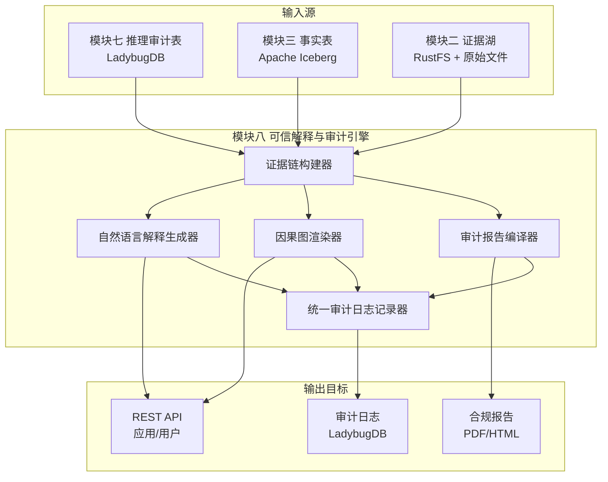
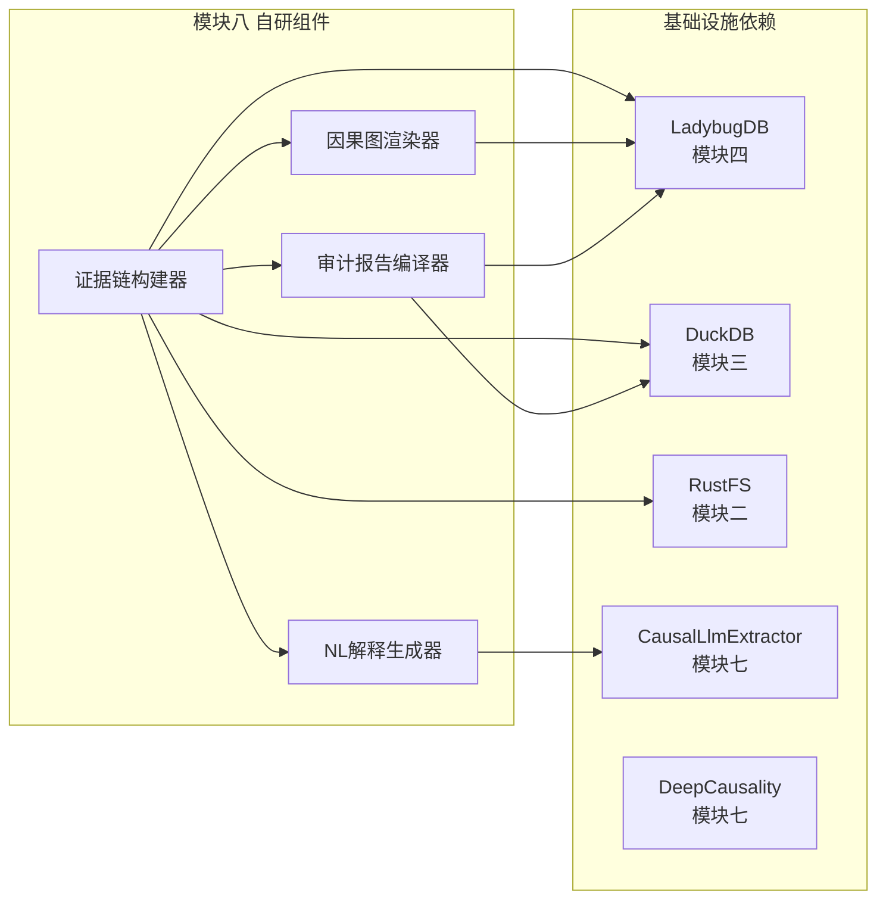

以下是补充了技术选型章节的**模块八：可信解释与审计引擎**完整设计文档。


## 模块八：可信解释与审计引擎 设计方案（含技术选型）

### 1. 模块定位

可信解释与审计引擎是 Causis 的“透明度窗口”。在模块七完成因果推理后，本模块负责将推理结果、证据链、推理路径和决策理由转化为人类可理解的解释，并提供完整的审计追溯能力。它不改变任何推理结果，而是作为独立于推理引擎的审查层和执行层，确保每一条由 Causis 产出的结论，都能向最终用户清晰回答两个核心问题：“为什么是这个结论？”以及“凭什么相信它？”。

### 2. 核心职责边界

| 职责               | 说明                                                         |
| :----------------- | :----------------------------------------------------------- |
| **多模态解释生成** | 将推理路径（节点序列、因果边、置信度）转译成自然语言、结构化 JSON 和可视化图形描述 |
| **证据链溯源**     | 从推理结论出发，沿着溯源指针回溯到模块三事实表、模块二证据湖原始文件的具体段落或单元格 |
| **交互式因果叙事** | 支持用户逐层展开推理路径，查看每个推理步骤的输入、输出和依据 |
| **审计日志全记录** | 记录每一次查询、推理、人工裁决的完整上下文，形成不可篡改的审计轨迹 |
| **合规报告生成**   | 按模板自动生成面向监管和内部审计的标准化报告                 |

**排除项**：不改变任何推理结果，不重新计算因果效应。

### 3. 核心生成物与解释目标

| 解释物类型       | 目标用户         | 核心问题                       | 生成方式                 |
| :--------------- | :--------------- | :----------------------------- | :----------------------- |
| **自然语言解释** | 业务用户、管理者 | “为什么李四是最终审批人？”     | LLM 基于推理路径模板生成 |
| **结构化证据链** | 开发者、下游系统 | 推理步骤的完整溯源 JSON        | 推理审计表 + 事实表 JOIN |
| **交互式因果图** | 分析师、审计员   | 可视化展示因果传递路径         | 图查询结果 + 前端渲染    |
| **合规审计报告** | 审计员、监管机构 | 决策是否符合当时生效的规章制度 | 报告模板 + 规则版本历史  |

### 4. 架构设计



### 5. 详细功能设计

#### 5.1 证据链构建器

这是模块八的核心引擎，接收来自模块七的推理结果，通过级联查询重建从结论到原始数据的完整溯源链条。

**级联溯源查询Pipeline：**
1. 以模块七推理审计表中某条推理结果的 `trace_id` 为起点。
2. 从推理审计表的 `inference_path` 字段中提取因果路径上的节点序列。
3. 对每个节点，读取其 `_provenance_id`，在模块三事实表中 JOIN 查询，获取该事实的来源信息。
4. 从事实表中提取 `_source_file` 和 `_source_location`，进一步拼接证据湖的原始文件访问路径和文件内位置。
5. 从 LadybugDB 中查询冲突裁决日志（模块六），若该事实曾被裁决，附加裁决理由和未被采纳版本。
6. 最终生成一个五层可追溯的完整证据链：推理结论 → 推理步骤 → 事实记录 → 证据文件锚点 → 规则版本。

**输出格式（EvidenceGraph JSON Schema）：**
- 推理结论摘要（结论简述、置信度、生成时间）。
- 推理路径（步骤序列，每步包含节点标识、关系、置信度、类型）。
- 每步的证据锚点（来源文件、段落/单元格、版本快照ID、冲突裁决依据）。
- 裁决透明性（若此事实曾存在冲突，展示采纳版本、被拒绝版本及各自裁决理由）。

**性能优化**：对高频查询的 `provenance_id` 路径使用 LRU 内存缓存，减少重复 JOIN 开销，TTL 与 Iceberg 事实表的 `valid_until` 对齐。

#### 5.2 自然语言解释生成器

**核心策略**：模板骨架 + LLM 润色。利用预定义的解释模板构建因果链骨架，再由本地 ONNX 模型或 LLM API 对骨架进行自然语言润色。

**分级详细程度**：
- *摘要*：一句话说明结论和主要原因。
- *标准*：包含完整因果链和关键证据。
- *详细*：附带所有证据锚点，供审计使用。

**降级策略**：若 LLM 不可用，解释器降级为纯模板文本，保障基本可用。复用模块七的 LLM 双轨基础设施，仅用于语言润色，不重写推理结论。

**解释模板示例（请假审批场景）**：
```
结论：张三的请假申请应由赵六审批。
推理链：
  1. 张三汇报给李四（证据：员工名册2024-02-15.pdf，第2页表格第5行）。
  2. 李四当前状态为“出差中”（证据：OA系统实时状态快照）。
  3. 根据《考勤管理制度》v2.3 第5.2条，若直接上级无法审批，应流转给代理人。
  4. 李四的代理人设置为赵六（证据：代理人设置通知2024-03-10）。
  因此，最终审批人确定为赵六。
```

#### 5.3 交互式因果图渲染器

**核心能力**：
- 渲染推理路径上的所有节点和有向边，边宽表示置信度，节点颜色表示实体类型（人/规则/事件）。
- 支持用户点击任意节点/边，展开该节点的完整属性、来源证据锚点以及被拒绝的备选事实版本。
- 支持“版本快照回放”——通过时间滑块将图谱回溯到某个历史时间点，展示当时的实体关系和因果图状态。

**实现分工**：模块八后端通过 `CausalGraphRenderer` 结构体从 LadybugDB 读取推理子图，序列化为 Mermaid 格式和自定义 JSON 图形 DSL，一并返回给前端。前端负责实际的图绘制和动画界面（不在本模块范围）。

#### 5.4 审计报告编译器

面向正式审计场景，自动生成符合监管要求的标准化报告。

**报告结构**（参考 ISO 27001/PCI DSS 审计报告模板）：
1. 报告标题、生成时间与系统版本。
2. 决策概要（结论、时间、涉及数据源）。
3. 完整推理路径，每步附证据锚点。
4. 版本历史（推理时依赖的规则版本、数据版本、冲突裁决版本）。
5. 人工介入记录（若相关冲突经过人工裁决）。
6. 合规声明（所有推理步骤均符合当时生效的规章制度）。

**输出格式**：JSON（供下游系统消费）+ Markdown 转 PDF/HTML。

#### 5.5 统一审计日志记录器

| 事件类型     | 记录内容                                | 来源模块      |
| :----------- | :-------------------------------------- | :------------ |
| 查询日志     | 用户查询语句、查询类型、返回结果摘要    | API 层        |
| 推理日志     | 推理ID、因果图版本、推理路径、结果      | 模块七        |
| 裁决日志     | 冲突裁决决策、裁决人、被拒绝版本        | 模块六        |
| 数据变更日志 | 事实表的 INSERT/UPDATE，图谱节点/边增删 | 模块三/模块四 |
| 人工干预日志 | 人工裁决、实体消歧确认、规则修改        | 模块五/模块六 |

日志写入 LadybugDB 专用审计日志表，支持按时间范围、用户、查询类型等多维度检索，查询结果可直接关联到原始推理审计表获取详细上下文。写入操作通过 `AuditLogger` trait 抽象，日志写入失败不影响主业务流程。

### 6. 证据链完整示例

```
1. 结论：请假申请 #L-2024-089 应由赵六审批。
2. 推理路径：
    (张三)-[:ReportsTo]->(李四) 置信度:0.97
          [证据: HR系统员工名册v2.1, s3://raw/hr/roster_2024-02-15.pdf, 第2页表格Row5]
    (李四)-[:HasStatus]->(出差中) 置信度:0.93
          [证据: 门禁系统截图, s3://raw/oa/doorlog_2024-03-10.png]
    (出差中)-[:TriggersRule]->(规则5.2) 置信度:1.0
          [证据: 《考勤管理制度》v2.3, s3://raw/policies/attendance_v2.3.pdf, 第5页第2段]
    (规则5.2)-[:Specifies]->(代理人赵六) 置信度:1.0
          [证据: 代理人配置通知, s3://raw/hr/delegations/20240310.xlsx, Sheet1 Line3]
3. 裁决透明性：无冲突，所有事实为单一来源或所有来源一致。
4. 溯源代价：4次JOIN，总耗时12ms（含缓存命中）。
```

### 7. 技术选型

#### 7.1 选型总览

| 组件                   | 选型方案                                                     | 语言       | 核心职责                               | 许可       | 选型理由                                                     |
| :--------------------- | :----------------------------------------------------------- | :--------- | :------------------------------------- | :--------- | :----------------------------------------------------------- |
| **证据链构建器**       | 自研 Rust (`ProvenanceChainBuilder`)，配合 LadybugDB Cypher + DuckDB | Rust       | 多源级联溯源查询与证据组装             | —          | Causis 核心差异化能力，无现成替代方案，须自研；Cypher 负责图谱路径查询，DuckDB 负责结构化 JOIN |
| **自然语言解释生成器** | LLM 双轨制（复用模块七 `CausalLlmExtractor`），本地 `Candle` + 可选 API | Rust       | 结构化推理文本模板填充与语言润色       | —          | 复用已有基础设施，避免重复建设；双轨制确保离线和降级场景可用 |
| **因果图渲染数据源**   | 自研 Rust (`CausalGraphRenderer`) + LadybugDB Cypher         | Rust       | 将推理子图序列化为前端可消费的图形 DSL | —          | LadybugDB 已存储完整推理子图，直接从图查询结果序列化即可     |
| **审计日志持久化**     | LadybugDB 审计节点模型                                       | Rust FFI   | 统一审计日志的持久化、索引与检索       | MIT        | 复用模块四现有图数据库基础设施，不引入新的存储系统           |
| **合规报告生成**       | `printpdf` (Rust) / `spago` (Markdown→HTML)                  | Rust       | Markdown/JSON 转换为 PDF/HTML 报告     | MIT        | 纯 Rust 生态，无外部服务依赖；满足正式审计报告格式要求       |
| **约束校验**           | DeepCausality Effect Ethos                                   | Rust       | 因果输出的安全与合规校验               | Apache 2.0 | 已在模块七中集成，模块八直接复用同一校验管道                 |
| **前端可视化**         | Mermaid.js / D3.js + 模块八提供 JSON 图形 DSL                | JavaScript | 前端因果图渲染与交互                   | MIT        | 模块八只提供结构化图形数据，实际渲染由前端技术栈决定         |

#### 7.2 技术依赖关系



**核心依赖说明**：
- **LadybugDB**：证据链构建器通过 Cypher 查询推理子图，审计日志直接写入 LadybugDB 审计表，因果图渲染从 LadybugDB 读取推理路径节点与边。
- **DuckDB**：证据链构建器通过 DuckDB 执行 Iceberg 事实表的跨表 JOIN 查询，获取溯源字段与原始文件锚点信息。
- **RustFS**：证据链最终锚定到原始文件路径（PDF 页码、Excel 行列），通过 RustFS 的 S3 API 生成可访问的文件 URL。
- **模块七双轨 LLM**：从模块七重用 `CausalLlmExtractor` 组件，本地模型与 API 自动切换、可配置降级，零新增依赖。
- **DeepCausality Effect Ethos**：输出安全约束校验，模块八直接调用模块七已集成的校验管道。

#### 7.3 选型核心原则

1. **纯 Rust 无外部服务**：所有自研组件纯 Rust 实现，外部依赖仅限于 Causis 内部模块（LadybugDB、DuckDB、RustFS）和模块七已有的双轨 LLM 抽象，模块八自身零新增外部 API 调用。
2. **复用现有基础设施**：审计日志复用 LadybugDB 存储，证据查询复用 DuckDB 与 LadybugDB，LLM 能力复用模块七双轨抽象，不引入新的独立数据库或服务。
3. **降级策略完备**：LLM 不可用时自然语言解释自动降级为纯模板模式，API 故障不影响证据链构建与审计日志等核心功能。
4. **开源许可合规**：所有依赖均为 MIT 或 Apache 2.0 许可，与 Causis 整体许可证无冲突。

### 8. 审计与合规性保证

- **审计完整性**：所有解释输出均被记录，包含用户查询、返回的解释文本、证据链和生成时间。
- **证据不可篡改**：证据链依赖的证据湖和事实表基于 Apache Iceberg 的不可变快照机制，历史记录不可被删除或覆盖。
- **回溯能力**：任意历史时间点的版本快照可通过时间旅行查询复原。
- **访问控制**：审计日志读写权限通过 Causis 接入层的 RBAC 控制，敏感解释结果可配置脱敏规则。

### 9. 实施路线图

| 阶段      | 任务                                                         | 核心产出                                         | 关键依赖                     |
| :-------- | :----------------------------------------------------------- | :----------------------------------------------- | :--------------------------- |
| **MVP**   | 证据链构建器（单查询溯源到事实表），自然语言解释器（模板模式），基本审计日志写入 | 可展示“为什么是这个结论”的文本证据，审计日志可用 | LadybugDB + DuckDB + RustFS  |
| **增强1** | 自然语言 LLM 双轨润色，因果图可视化数据生成，审计日志多维度检索 | 交互式解释页面可用，审计员可按需查询             | CausalLlmExtractor（模块七） |
| **增强2** | 合规报告自动生成（PDF/HTML），交互式版本快照回放，全部证据回溯到原始文件锚点 | 可正式用于监管审计                               | printpdf/spago               |
| **成熟**  | 自然语言解释多语言本地化，解释质量持续优化，审计报告模板库完善 | 全功能“透明即服务”                               | —                            |

### 10. 总结

模块八通过证据链构建器、自然语言解释生成器、因果图渲染器、审计报告编译器和统一审计日志记录器五大组件，将模块七的因果推理结果转化为人类可理解、可追溯、可审计的完整解释。所有组件均基于纯 Rust 自研或复用 Causis 内部模块已有基础设施，零新增外部服务依赖，LLM 双轨制确保离线和降级场景可用。最终为 Causis 闭环“因果即服务”的最后一公里——让推理结果真正可解释、可信任。